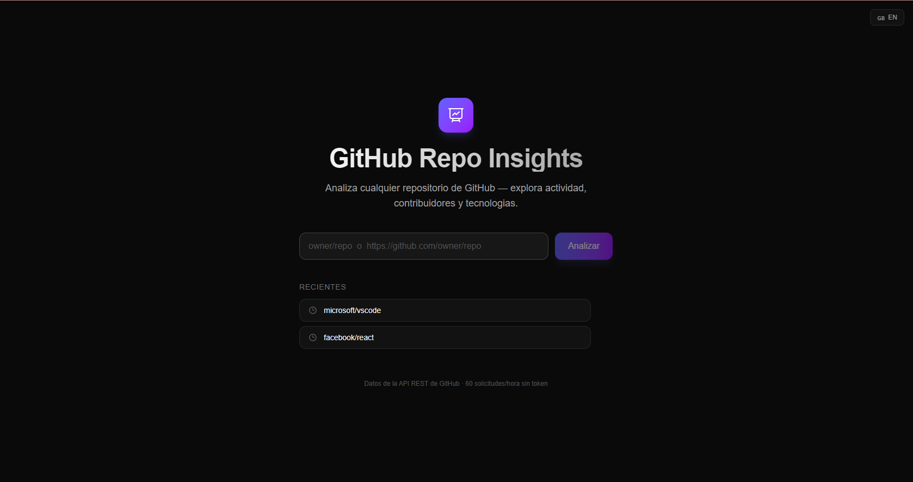
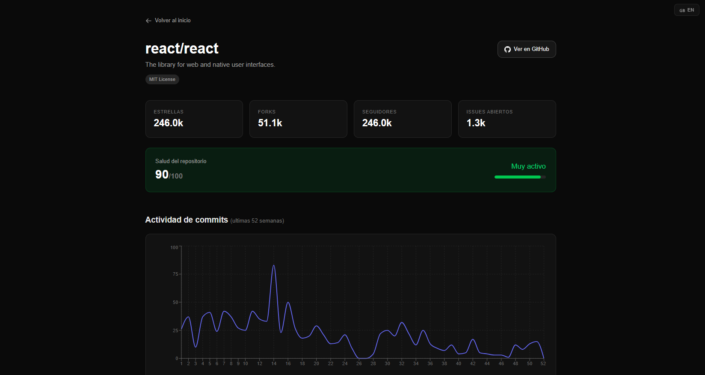
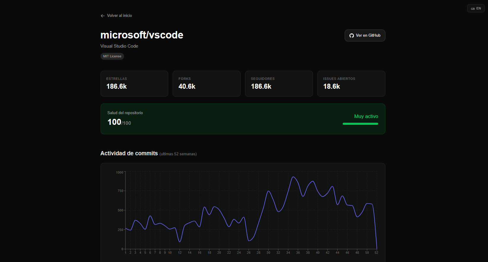

# GitHub Repo Insights

GitHub Repo Insights is a web application that analyzes public GitHub repositories and presents repository metrics through interactive charts and visual dashboards.

The application uses the GitHub REST API to display repository activity, contributor information, language distribution and a custom repository health score.

## Live Demo

https://github-repo-insights.vercel.app

## Screenshots

### Home Page

### Repository Analysis (React)

### Repository Analysis (VS Code)

## Features

* Repository search using `owner/repository` or a GitHub URL
* Repository statistics (stars, forks, watchers and issues)
* Contributor analysis
* Weekly commit activity charts
* Language distribution visualization
* Repository health score
* English and Spanish localization
* Recent searches persistence

## Technical Overview

The application combines multiple GitHub API endpoints to build a repository dashboard.

The analysis includes repository statistics, contributor activity, commit history, language usage and a custom health score based on activity, popularity and community adoption.

## Tech Stack

* Next.js 16
* React 19
* TypeScript
* Tailwind CSS
* Recharts
* GitHub REST API

## License

MIT
